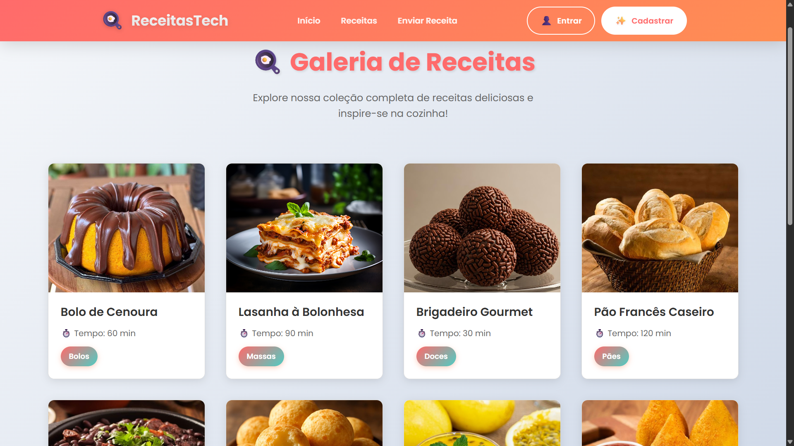
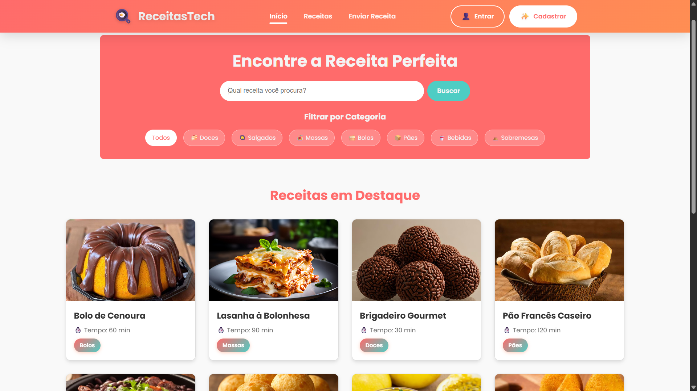

<div align="center">

# 🍳 ReceitasTech

**A modern recipe website with real-time search, category filters, and responsive design**

[](https://devluquinha.github.io/receitas-tech/)
[](https://developer.mozilla.org/en-US/docs/Web/HTML)
[](https://developer.mozilla.org/en-US/docs/Web/CSS)
[](https://developer.mozilla.org/en-US/docs/Web/JavaScript)
[](LICENSE)

[🇺🇸 English](#english) | [🇧🇷 Português](#português)

</div>

---

<div id="english"></div>

## 🎥 Demo

### Video Demo

https://github.com/DevLuquinha/receitas-tech/assets/marketing/ReceitasTech.mp4

### Screenshots

<div align="center">
  
  
</div>

---

## 📖 Table of Contents

- [About the Project](#about-the-project)
- [Features](#features)
- [Technologies](#technologies-used)
- [Project Structure](#project-structure)
- [Getting Started](#getting-started)
- [Design System](#design-system)
- [Technical Features](#technical-features)
- [Data Structure](#data-structure)
- [Roadmap](#roadmap)
- [Contributing](#contributing)
- [Troubleshooting](#troubleshooting)
- [License](#license)
- [Developer](#developer)

---

## 📋 About the Project

**ReceitasTech** is a modern and intuitive web platform for discovering, exploring, and sharing amazing culinary recipes. Focused on user experience and performance, the website offers real-time search, dynamic filters, and a responsive design that works perfectly on any device.

### 🎯 Goal

Create a simple and enjoyable experience for recipe seekers by combining:
- **Functionality**: Fast search and intelligent filters
- **Design**: Modern and attractive interface
- **Performance**: Fast and optimized loading
- **Accessibility**: Semantic and responsive code

---

## ✨ Features

### 🔍 **Search and Filters**
- ✅ Real-time search as you type
- ✅ Category filters (Sweets, Savory, Pasta, Cakes, Breads, Drinks, Desserts)
- ✅ Combined search + category filter
- ✅ Visual feedback when no results found

### 📱 **Interface and Design**
- ✅ Responsive design (Mobile, Tablet, Desktop)
- ✅ Recipe cards with images and information
- ✅ Hover effects and smooth transitions
- ✅ Loading spinner during data fetch
- ✅ User-friendly error messages

### 🍽️ **Recipes**
- ✅ Detailed page for each recipe
- ✅ Complete ingredients list
- ✅ Step-by-step preparation guide
- ✅ Information: time, difficulty, servings
- ✅ High-quality images
- ✅ Tags and categorization

### 📝 **Recipe Submission**
- ✅ Complete form to submit recipes
- ✅ Image upload (with preview)
- ✅ Field validation
- ✅ Dynamic fields (ingredients, steps, tips)
- ✅ Auto-calculation of total time
- ✅ Confirmation modal

### 🚀 **Performance**
- ✅ Retry system for API requests
- ✅ Lazy loading for images
- ✅ Optimized paths for GitHub Pages
- ✅ Resource caching and optimization

---

## 🛠️ Technologies Used

### Frontend
- **HTML5**: Semantic and accessible structure
- **CSS3**: Modern and responsive styling
  - CSS Grid and Flexbox
  - CSS Variables (Custom Properties)
  - Animations and Transitions
  - Media Queries
- **JavaScript ES6+**: Logic and interactivity
  - Async/Await
  - Fetch API
  - DOM Manipulation
  - Event Listeners
  - Arrow Functions

### External Resources
- **Google Fonts**: Poppins (300, 400, 600, 700)
- **GitHub Pages**: Free hosting

### Development Tools
- **VS Code**: Code editor
- **Git**: Version control
- **Live Server**: Local development server

---

## 📁 Project Structure

```
receitas-tech/
├── 📄 index.html                    # Main page
├── 📄 LICENSE                       # Project license
├── 📄 README.md                     # This file
│
├── 📁 assets/                       # Project resources
│   ├── 📁 components/              
│   │   └── header.html             # Header component
│   │
│   ├── 📁 css/                     # Styles
│   │   ├── style.css               # ⭐ Main CSS (imports all)
│   │   ├── variables.css           # Global variables (colors, spacing)
│   │   ├── base.css                # Reset and base styles
│   │   ├── components.css          # Reusable components
│   │   ├── header.css              # Header styles
│   │   ├── index.css               # Home page
│   │   ├── recipes.css             # Gallery page
│   │   ├── recipe-detail.css       # Detail page
│   │   ├── submit-recipe.css       # Submission page
│   │   └── responsive.css          # Media queries
│   │
│   ├── 📁 data/                    # JSON data
│   │   └── recipes.json            # Recipe database
│   │
│   ├── 📁 images/                  # Recipe images
│   │   ├── bolo-cenoura.jpeg
│   │   ├── brigadeiro.jpeg
│   │   ├── lasanha.jpg
│   │   └── pao-frances.jpeg
│   │
│   └── 📁 js/                      # JavaScript files
│       ├── api.js                  # API functions (getData, loading, error)
│       ├── header.js               # Header logic
│       ├── script.js               # Main page
│       ├── recipes.js              # Gallery page
│       ├── recipe.js               # Detail page
│       └── submit-recipe.js        # Submission page
│
├── 📁 docs/                        # Documentation
│   └── CSS_STRUCTURE.md            # CSS structure
│
└── 📁 pages/                       # HTML pages
    ├── recipe.html                 # Recipe details
    ├── recipes.html                # Recipe gallery
    ├── submit-recipe.html          # Submit recipe
    └── template.html               # Base template
```

---

## 🚀 Getting Started

### Prerequisites

- Modern web browser (Chrome, Firefox, Safari, Edge)
- Code editor (VS Code recommended)
- Git (optional)

### Installation and Execution

#### **Option 1: Access Online**
```
https://devluquinha.github.io/receitas-tech/
```

#### **Option 2: Run Locally**

1. **Clone the repository**
   ```bash
   git clone https://github.com/DevLuquinha/receitas-tech.git
   cd receitas-tech
   ```

2. **Open in browser**
   
   **Method A - Direct:**
   - Open the `index.html` file directly in the browser
   
   **Method B - Live Server (Recommended):**
   - Install "Live Server" extension in VS Code
   - Right-click on `index.html` → "Open with Live Server"
   
   **Method C - Python:**
   ```bash
   # Python 3
   python -m http.server 8000
   
   # Access: http://localhost:8000
   ```

3. **Navigate the website**
   - Use the search bar to find recipes
   - Click on category filters
   - Explore recipe details
   - Test the recipe submission page

---

## 🎨 Design System

### Color Palette

```css
/* Primary Colors */
--primary-color: #FF6B6B      /* Vibrant red */
--secondary-color: #4ECDC4    /* Aqua green */

/* Text Colors */
--text-color-dark: #333       /* Dark text */
--text-color-light: #f4f4f4   /* Light text */

/* Background Colors */
--background-light: #ffffff   /* White background */
--background-dark: #f9f9f9    /* Light gray background */

/* Border Colors */
--border-color: #ddd          /* Gray border */
```

### Typography

- **Font**: Poppins (Google Fonts)
- **Weights**: 300 (Light), 400 (Regular), 600 (SemiBold), 700 (Bold)
- **Sizes**:
  - Headings: 2.5rem - 3rem
  - Subheadings: 1.5rem - 2rem
  - Body: 1rem
  - Small: 0.85rem

### Spacing

```css
--spacing-unit: 1rem       /* Base: 16px */
--spacing-small: 0.5rem    /* 8px */
--spacing-medium: 1.5rem   /* 24px */
--spacing-large: 2rem      /* 32px */
--spacing-xlarge: 3rem     /* 48px */
```

### Border Radius

```css
--border-radius-small: 8px
--border-radius-medium: 12px
--border-radius-large: 20px
--border-radius-round: 50px
```

---

## 📱 Responsiveness

### Breakpoints

```css
/* Desktop (default) */
> 768px

/* Tablet */
≤ 768px

/* Mobile */
≤ 480px

/* Large Desktop (optional) */
≥ 1400px
```

### Responsive Behavior

- **Recipe grid**: Automatically adapts columns
- **Header**: Hamburger menu on mobile
- **Cards**: Limited maximum width
- **Images**: Resize proportionally
- **Forms**: Single column on mobile

---

## 🔧 Technical Features

### JavaScript

#### **Real-Time Search**
```javascript
searchInput.addEventListener('keyup', filterAndDisplayRecipes);
```
- Filters recipes as the user types
- Combines text search + category filter
- Optimized performance (no unnecessary delays)

#### **DOM Manipulation**
```javascript
recipesToDisplay.forEach(recipe => {
    const cardLink = document.createElement('a');
    // Creates elements dynamically
});
```

#### **Retry System**
```javascript
async function getData(url, retries = 2) {
    // Retries on failure
    // Incremental delay between attempts
}
```

#### **Path Correction (GitHub Pages)**
```javascript
function fixImagePath(imagePath, isSubPage = false) {
    // Detects environment (local vs GitHub Pages)
    // Automatically adjusts paths
}
```

### CSS

#### **CSS Variables**
```css
:root {
    --primary-color: #FF6B6B;
}

.button {
    background: var(--primary-color);
}
```

#### **Responsive Grid**
```css
.recipe-grid {
    display: grid;
    grid-template-columns: repeat(auto-fill, minmax(280px, 1fr));
    gap: 2rem;
}
```

#### **Smooth Transitions**
```css
.recipe-card {
    transition: transform var(--transition-normal);
}

.recipe-card:hover {
    transform: translateY(-8px);
}
```

---

## 📊 Data Structure

### Recipe Model (JSON)

```json
{
    "id": 1,
    "title": "Carrot Cake",
    "description": "A classic Brazilian cake...",
    "image": "assets/images/bolo-cenoura.jpeg",
    "category": "cakes",
    "difficulty": "Easy",
    "servings": 12,
    "prepTime": "20 min",
    "cookTime": "40 min",
    "totalTime": "60 min",
    "ingredients": ["...", "..."],
    "prepMode": ["...", "..."],
    "tips": ["...", "..."],
    "tags": ["...", "..."],
    "author": "ReceitasTech",
    "createdAt": "2024-01-15",
    "rating": 4.8,
    "reviews": 342
}
```

---

## 🔮 Roadmap

### In Development
- [ ] Dark mode
- [ ] Search by ingredients
- [ ] Advanced filters (time, difficulty)

### Planned
- [ ] Backend with ASP.NET Core (C#)
- [ ] Database (PostgreSQL or MySQL)
- [ ] User authentication
- [ ] Rating and comment system
- [ ] Real image upload
- [ ] Social sharing
- [ ] PWA (Progressive Web App)
- [ ] Synchronized favorite recipes
- [ ] Complete REST API

---

## 🤝 Contributing

Contributions are always welcome! Here's how you can help:

### 1. Fork the Project
```bash
# Click "Fork" on GitHub
```

### 2. Create a Branch
```bash
git checkout -b feature/MyNewFeature
```

### 3. Make Your Changes
```bash
git add .
git commit -m "Add: my amazing new feature"
```

### 4. Push to GitHub
```bash
git push origin feature/MyNewFeature
```

### 5. Open a Pull Request
- Describe your changes
- Add screenshots if visual changes
- Wait for review

### Types of Contributions

- 🐛 Report bugs
- ✨ Suggest new features
- 📝 Improve documentation
- 🎨 Improve design/UX
- ⚡ Performance optimizations
- ♿ Accessibility improvements

---

## 📝 Code Conventions

### JavaScript
```javascript
// ✅ Good
const userName = "João";
function calculateTotal(items) {
    return items.reduce((sum, item) => sum + item.price, 0);
}

// ❌ Avoid
var user_name = "João";
function calc(i) {
    let t = 0;
    for(let x of i) t += x.price;
    return t;
}
```

### CSS
```css
/* ✅ Good - Use variables */
.button {
    background: var(--primary-color);
    padding: var(--spacing-medium);
}

/* ❌ Avoid - Hardcoded values */
.button {
    background: #FF6B6B;
    padding: 24px;
}
```

### Commits
```bash
# Format: Type: Short description

Add: new search functionality
Fix: fixes bug in category filter
Update: updates README with new information
Style: improves card styling
Refactor: reorganizes folder structure
Docs: adds API documentation
```

---

## 🐛 Troubleshooting

### Images not loading
```bash
# Check if images exist in assets/images/
# Clear browser cache (Ctrl + Shift + R)
# Check console for 404 errors
```

### Styles not applied
```bash
# Check if style.css is being imported
# Confirm all @imports are correct
# Clear cache (Ctrl + F5)
```

### JavaScript not working
```bash
# Open Console (F12)
# Check for console errors
# Confirm scripts are in correct order
```

---

## 📄 License

This project is licensed under the license specified in the [LICENSE](LICENSE) file.

---

## 👨‍💻 Developer

**DevLuquinha**

- GitHub: [@DevLuquinha](https://github.com/DevLuquinha)
- LinkedIn: [Lucas Emmanuel](https://www.linkedin.com/in/devlucasemmanuel/)

---

## 🙏 Acknowledgments

- Google Fonts for Poppins font
- GitHub Pages for free hosting
- Open source community

---

## 📈 Project Status

🟢 **Active and in development**

- Last update: December 2025
- Version: 1.0.0
- Status: Functional and hosted

---

<div align="center">

### ⭐ If this project helped you, consider giving it a star!

**Made with ❤️ and ☕ by DevLuquinha**

</div>

---
---

<div id="português"></div>

# 🇧🇷 Versão em Português

## 🎥 Demonstração

### Vídeo Demo

https://github.com/DevLuquinha/receitas-tech/assets/marketing/ReceitasTech.mp4

### Capturas de Tela

<div align="center">
  
  
</div>

---

## 📖 Índice

- [Sobre o Projeto](#sobre-o-projeto)
- [Funcionalidades](#funcionalidades)
- [Tecnologias](#tecnologias-utilizadas)
- [Estrutura do Projeto](#estrutura-do-projeto)
- [Como Usar](#como-usar)
- [Design System](#design-system)
- [Funcionalidades Técnicas](#funcionalidades-técnicas)
- [Estrutura de Dados](#estrutura-de-dados)
- [Roadmap](#roadmap)
- [Como Contribuir](#como-contribuir)
- [Troubleshooting](#troubleshooting)
- [Licença](#licença)
- [Desenvolvedor](#desenvolvedor)

---

## 📋 Sobre o Projeto

**ReceitasTech** é uma plataforma web moderna e intuitiva para descobrir, explorar e compartilhar receitas culinárias incríveis. Com foco em experiência do usuário e performance, o site oferece busca em tempo real, filtros dinâmicos e um design responsivo que funciona perfeitamente em qualquer dispositivo.

### 🎯 Objetivo

Criar uma experiência simples e agradável para quem busca receitas, combinando:
- **Funcionalidade**: Busca rápida e filtros inteligentes
- **Design**: Interface moderna e atraente
- **Performance**: Carregamento rápido e otimizado
- **Acessibilidade**: Código semântico e responsivo

---

## ✨ Funcionalidades

### 🔍 **Busca e Filtros**
- ✅ Busca em tempo real enquanto você digita
- ✅ Filtros por categoria (Doces, Salgados, Massas, Bolos, Pães, Bebidas, Sobremesas)
- ✅ Combinação de busca + filtro de categoria
- ✅ Feedback visual quando não há resultados

### 📱 **Interface e Design**
- ✅ Design responsivo (Mobile, Tablet, Desktop)
- ✅ Cards de receitas com imagens e informações
- ✅ Efeitos hover e transições suaves
- ✅ Loading spinner durante carregamento
- ✅ Mensagens de erro amigáveis

### 🍽️ **Receitas**
- ✅ Página detalhada para cada receita
- ✅ Lista de ingredientes completa
- ✅ Modo de preparo passo a passo
- ✅ Informações: tempo, dificuldade, porções
- ✅ Imagens em alta qualidade
- ✅ Tags e categorização

### 📝 **Envio de Receitas**
- ✅ Formulário completo para enviar receitas
- ✅ Upload de imagens (com preview)
- ✅ Validação de campos
- ✅ Campos dinâmicos (ingredientes, passos, dicas)
- ✅ Auto-cálculo de tempo total
- ✅ Modal de confirmação

### 🚀 **Performance**
- ✅ Sistema de retry em requisições
- ✅ Lazy loading de imagens
- ✅ Caminhos otimizados para GitHub Pages
- ✅ Cache e otimização de recursos

---

## 🛠️ Tecnologias Utilizadas

### Frontend
- **HTML5**: Estrutura semântica e acessível
- **CSS3**: Estilização moderna e responsiva
  - CSS Grid e Flexbox
  - CSS Variables (Custom Properties)
  - Animations e Transitions
  - Media Queries
- **JavaScript ES6+**: Lógica e interatividade
  - Async/Await
  - Fetch API
  - DOM Manipulation
  - Event Listeners
  - Arrow Functions

### Recursos Externos
- **Google Fonts**: Poppins (300, 400, 600, 700)
- **GitHub Pages**: Hospedagem gratuita

### Ferramentas de Desenvolvimento
- **VS Code**: Editor de código
- **Git**: Controle de versão
- **Live Server**: Servidor de desenvolvimento local

---

## 📁 Estrutura do Projeto

```
receitas-tech/
├── 📄 index.html                    # Página principal
├── 📄 LICENSE                       # Licença do projeto
├── 📄 README.md                     # Este arquivo
│
├── 📁 assets/                       # Recursos do projeto
│   ├── 📁 components/              
│   │   └── header.html             # Componente header
│   │
│   ├── 📁 css/                     # Estilos
│   │   ├── style.css               # ⭐ CSS principal (importa todos)
│   │   ├── variables.css           # Variáveis globais (cores, espaços)
│   │   ├── base.css                # Reset e estilos base
│   │   ├── components.css          # Componentes reutilizáveis
│   │   ├── header.css              # Estilos do header
│   │   ├── index.css               # Página inicial
│   │   ├── recipes.css             # Página de galeria
│   │   ├── recipe-detail.css       # Página de detalhes
│   │   ├── submit-recipe.css       # Página de envio
│   │   └── responsive.css          # Media queries
│   │
│   ├── 📁 data/                    # Dados JSON
│   │   └── recipes.json            # Base de receitas
│   │
│   ├── 📁 images/                  # Imagens das receitas
│   │   ├── bolo-cenoura.jpeg
│   │   ├── brigadeiro.jpeg
│   │   ├── lasanha.jpg
│   │   └── pao-frances.jpeg
│   │
│   └── 📁 js/                      # Scripts JavaScript
│       ├── api.js                  # Funções de API (getData, loading, error)
│       ├── header.js               # Lógica do header
│       ├── script.js               # Página principal
│       ├── recipes.js              # Página de galeria
│       ├── recipe.js               # Página de detalhes
│       └── submit-recipe.js        # Página de envio
│
├── 📁 docs/                        # Documentação
│   └── CSS_STRUCTURE.md            # Estrutura do CSS
│
└── 📁 pages/                       # Páginas HTML
    ├── recipe.html                 # Detalhes da receita
    ├── recipes.html                # Galeria de receitas
    ├── submit-recipe.html          # Enviar receita
    └── template.html               # Template base
```

---

## 🚀 Como Usar

### Pré-requisitos

- Navegador web moderno (Chrome, Firefox, Safari, Edge)
- Editor de código (VS Code recomendado)
- Git (opcional)

### Instalação e Execução

#### **Opção 1: Acessar Online**
```
https://devluquinha.github.io/receitas-tech/
```

#### **Opção 2: Executar Localmente**

1. **Clone o repositório**
   ```bash
   git clone https://github.com/DevLuquinha/receitas-tech.git
   cd receitas-tech
   ```

2. **Abra no navegador**
   
   **Método A - Direto:**
   - Abra o arquivo `index.html` diretamente no navegador
   
   **Método B - Live Server (Recomendado):**
   - Instale a extensão "Live Server" no VS Code
   - Clique direito em `index.html` → "Open with Live Server"
   
   **Método C - Python:**
   ```bash
   # Python 3
   python -m http.server 8000
   
   # Acesse: http://localhost:8000
   ```

3. **Navegue pelo site**
   - Use a barra de busca para procurar receitas
   - Clique nos filtros de categoria
   - Explore os detalhes das receitas
   - Teste a página de envio de receitas

---

## 🎨 Design System

### Paleta de Cores

```css
/* Cores Principais */
--primary-color: #FF6B6B      /* Vermelho vibrante */
--secondary-color: #4ECDC4    /* Verde água */

/* Cores de Texto */
--text-color-dark: #333       /* Texto escuro */
--text-color-light: #f4f4f4   /* Texto claro */

/* Cores de Fundo */
--background-light: #ffffff   /* Fundo branco */
--background-dark: #f9f9f9    /* Fundo cinza claro */

/* Cores de Borda */
--border-color: #ddd          /* Borda cinza */
```

### Tipografia

- **Fonte**: Poppins (Google Fonts)
- **Pesos**: 300 (Light), 400 (Regular), 600 (SemiBold), 700 (Bold)
- **Tamanhos**:
  - Títulos: 2.5rem - 3rem
  - Subtítulos: 1.5rem - 2rem
  - Corpo: 1rem
  - Pequeno: 0.85rem

### Espaçamentos

```css
--spacing-unit: 1rem       /* Base: 16px */
--spacing-small: 0.5rem    /* 8px */
--spacing-medium: 1.5rem   /* 24px */
--spacing-large: 2rem      /* 32px */
--spacing-xlarge: 3rem     /* 48px */
```

### Border Radius

```css
--border-radius-small: 8px
--border-radius-medium: 12px
--border-radius-large: 20px
--border-radius-round: 50px
```

---

## 📱 Responsividade

### Breakpoints

```css
/* Desktop (padrão) */
> 768px

/* Tablet */
≤ 768px

/* Mobile */
≤ 480px

/* Desktop Large (opcional) */
≥ 1400px
```

### Comportamento Responsivo

- **Grid de receitas**: Adapta colunas automaticamente
- **Header**: Menu hamburger em mobile
- **Cards**: Largura máxima limitada
- **Imagens**: Redimensionam proporcionalmente
- **Formulários**: Uma coluna em mobile

---

## 🔧 Funcionalidades Técnicas

### JavaScript

#### **Busca em Tempo Real**
```javascript
searchInput.addEventListener('keyup', filterAndDisplayRecipes);
```
- Filtra receitas enquanto o usuário digita
- Combina busca por texto + filtro de categoria
- Performance otimizada (sem delays desnecessários)

#### **Manipulação do DOM**
```javascript
recipesToDisplay.forEach(recipe => {
    const cardLink = document.createElement('a');
    // Cria elementos dinamicamente
});
```

#### **Sistema de Retry**
```javascript
async function getData(url, retries = 2) {
    // Tenta novamente em caso de falha
    // Delay incremental entre tentativas
}
```

#### **Correção de Caminhos (GitHub Pages)**
```javascript
function fixImagePath(imagePath, isSubPage = false) {
    // Detecta ambiente (local vs GitHub Pages)
    // Ajusta caminhos automaticamente
}
```

### CSS

#### **CSS Variables**
```css
:root {
    --primary-color: #FF6B6B;
}

.button {
    background: var(--primary-color);
}
```

#### **Grid Responsivo**
```css
.recipe-grid {
    display: grid;
    grid-template-columns: repeat(auto-fill, minmax(280px, 1fr));
    gap: 2rem;
}
```

#### **Transições Suaves**
```css
.recipe-card {
    transition: transform var(--transition-normal);
}

.recipe-card:hover {
    transform: translateY(-8px);
}
```

---

## 📊 Estrutura de Dados

### Modelo de Receita (JSON)

```json
{
    "id": 1,
    "title": "Bolo de Cenoura",
    "description": "Um clássico bolo brasileiro...",
    "image": "assets/images/bolo-cenoura.jpeg",
    "category": "bolos",
    "difficulty": "Fácil",
    "servings": 12,
    "prepTime": "20 min",
    "cookTime": "40 min",
    "totalTime": "60 min",
    "ingredients": ["...", "..."],
    "prepMode": ["...", "..."],
    "tips": ["...", "..."],
    "tags": ["bolo", "cenoura"],
    "author": "ReceitasTech",
    "createdAt": "2024-01-15",
    "rating": 4.8,
    "reviews": 342
}
```

---

## 🔮 Roadmap - Próximas Funcionalidades

### Em Desenvolvimento
- [ ] Modo escuro (dark mode)
- [ ] Pesquisa por ingredientes
- [ ] Filtros avançados (tempo, dificuldade)

### Planejado
- [ ] Backend com ASP.NET Core (C#)
- [ ] Banco de dados (PostgreSQL ou MySQL)
- [ ] Autenticação de usuários
- [ ] Sistema de avaliações e comentários
- [ ] Upload real de imagens
- [ ] Compartilhamento social
- [ ] PWA (Progressive Web App)
- [ ] Receitas favoritas sincronizadas
- [ ] API REST completa

---

## 🤝 Como Contribuir

Contribuições são sempre bem-vindas! Aqui está como você pode ajudar:

### 1. Fork o Projeto
```bash
# Clique em "Fork" no GitHub
```

### 2. Crie uma Branch
```bash
git checkout -b feature/MinhaNovaFeature
```

### 3. Faça suas Alterações
```bash
git add .
git commit -m "Add: minha nova feature incrível"
```

### 4. Push para o GitHub
```bash
git push origin feature/MinhaNovaFeature
```

### 5. Abra um Pull Request
- Descreva suas mudanças
- Adicione screenshots se for mudança visual
- Aguarde review

### Tipos de Contribuições

- 🐛 Reportar bugs
- ✨ Sugerir novas funcionalidades
- 📝 Melhorar documentação
- 🎨 Melhorar design/UX
- ⚡ Otimizações de performance
- ♿ Melhorias de acessibilidade

---

## 📝 Convenções de Código

### JavaScript
```javascript
// ✅ Bom
const userName = "João";
function calculateTotal(items) {
    return items.reduce((sum, item) => sum + item.price, 0);
}

// ❌ Evite
var user_name = "João";
function calc(i) {
    let t = 0;
    for (let x = 0; x < i.length; x++) {
        t += i[x].price;
    }
    return t;
}
```

### CSS
```css
/* ✅ Bom - Use variáveis */
.button {
    background: var(--primary-color);
    padding: var(--spacing-medium);
}

/* ❌ Evite - Valores hardcoded */
.button {
    background: #FF6B6B;
    padding: 24px;
}
```

### Commits
```bash
# Formato: Tipo: Descrição curta

Add: nova funcionalidade de busca
Fix: corrige bug no filtro de categorias
Update: atualiza README com novas informações
Style: melhora estilo dos cards
Refactor: reorganiza estrutura de pastas
Docs: adiciona documentação da API
```

---

## 🐛 Troubleshooting

### Imagens não carregam
```bash
# Verifique se as imagens existem em assets/images/
# Limpe o cache do navegador (Ctrl + Shift + R)
# Verifique o console para erros 404
```

### Estilos não aplicados
```bash
# Verifique se style.css está sendo importado
# Confirme que todos os @imports estão corretos
# Limpe cache (Ctrl + F5)
```

### JavaScript não funciona
```bash
# Abra o Console (F12)
# Verifique erros no console
# Confirme que scripts estão na ordem correta
```

---

## 📄 Licença

Este projeto está sob a licença especificada no arquivo [LICENSE](LICENSE).

---

## 👨‍💻 Desenvolvedor

**DevLuquinha**

- GitHub: [@DevLuquinha](https://github.com/DevLuquinha)
- LinkedIn: [LinkedIn](https://www.linkedin.com/in/devlucasemmanuel/)

---

## 🙏 Agradecimentos

- Google Fonts pela fonte Poppins
- GitHub Pages pela hospedagem gratuita
- Comunidade open source

---

## 📈 Status do Projeto

🟢 **Ativo e em desenvolvimento**

- Última atualização: Dezembro 2025
- Versão: 1.0.0
- Status: Funcional e hospedado

---

<div align="center">

### ⭐ Se este projeto te ajudou, considere dar uma estrela!

**Feito com ❤️ e ☕ por DevLuquinha**

</div>